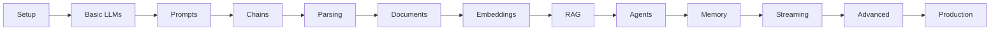

# LangChain for Beginners 🔗

A comprehensive, hands-on course that takes you from zero knowledge to building production-ready AI applications with LangChain.

## 🎯 Course Overview

This course teaches LangChain through a proven **teach-practice-teach-practice** pattern. Each concept is demonstrated by the instructor, then immediately practiced by learners. By the end, you'll be able to build sophisticated AI applications including chatbots, RAG systems, and autonomous agents.

## 📚 Course Notebooks

Click any badge to open the notebook directly in Google Colab:

### Module 00: Introduction and Setup
[](https://colab.research.google.com/github/vivmagarwal/agentic_ai_weekend_course/blob/main/langchain_for_beginners/notebooks/00_introduction_and_setup.ipynb)
Get started with LangChain, set up your environment, and make your first API calls.

### Module 01: Basic LLM Calls
[](https://colab.research.google.com/github/vivmagarwal/agentic_ai_weekend_course/blob/main/langchain_for_beginners/notebooks/01_basic_llm_calls.ipynb)
Master different message types, multi-turn conversations, and provider flexibility.

### Module 02: Prompts & Templates
[](https://colab.research.google.com/github/vivmagarwal/agentic_ai_weekend_course/blob/main/langchain_for_beginners/notebooks/02_prompts_and_templates.ipynb)
Create reusable, dynamic prompts and implement effective prompt engineering.

### Module 03: Chains & LCEL
[](https://colab.research.google.com/github/vivmagarwal/agentic_ai_weekend_course/blob/main/langchain_for_beginners/notebooks/03_chains_and_lcel.ipynb)
Build complex workflows using LangChain Expression Language.

### Module 04: Output Parsing
[](https://colab.research.google.com/github/vivmagarwal/agentic_ai_weekend_course/blob/main/langchain_for_beginners/notebooks/04_output_parsing.ipynb)
Structure LLM outputs with parsers and Pydantic models.

### Module 05: Document Loading & Splitting
[](https://colab.research.google.com/github/vivmagarwal/agentic_ai_weekend_course/blob/main/langchain_for_beginners/notebooks/05_document_loading.ipynb)
Process PDFs, websites, and text files effectively.

### Module 06: Embeddings & Vector Stores
[](https://colab.research.google.com/github/vivmagarwal/agentic_ai_weekend_course/blob/main/langchain_for_beginners/notebooks/06_embeddings_and_vectors.ipynb)
Understand semantic search fundamentals and vector databases.

### Module 07: RAG Systems
[](https://colab.research.google.com/github/vivmagarwal/agentic_ai_weekend_course/blob/main/langchain_for_beginners/notebooks/07_rag_systems.ipynb)
Build complete Retrieval Augmented Generation applications.

### Module 08: Tools & Agents
[](https://colab.research.google.com/github/vivmagarwal/agentic_ai_weekend_course/blob/main/langchain_for_beginners/notebooks/08_tools_and_agents.ipynb)
Create autonomous AI agents with custom tools.

### Module 09: Memory & Conversations
[](https://colab.research.google.com/github/vivmagarwal/agentic_ai_weekend_course/blob/main/langchain_for_beginners/notebooks/09_memory_and_conversations.ipynb)
Manage chat history and conversation context effectively.

### Module 10: Streaming & Real-time
[](https://colab.research.google.com/github/vivmagarwal/agentic_ai_weekend_course/blob/main/langchain_for_beginners/notebooks/10_streaming_and_realtime.ipynb)
Implement streaming for better user experience.

### Module 11: Advanced Patterns
[](https://colab.research.google.com/github/vivmagarwal/agentic_ai_weekend_course/blob/main/langchain_for_beginners/notebooks/11_advanced_patterns.ipynb)
Master batch processing, parallel execution, and optimization.

### Module 12: Production Deployment
[](https://colab.research.google.com/github/vivmagarwal/agentic_ai_weekend_course/blob/main/langchain_for_beginners/notebooks/12_production_deployment.ipynb)
Deploy production-ready LLM applications with proper error handling.

## 📚 What You'll Learn

### Core Concepts (13 Activities)
0. **Introduction & Setup** - Understanding LangChain's role in the AI ecosystem
1. **Basic LLM Calls** - Making your first API calls to OpenAI, Anthropic, and Google
2. **Prompts & Templates** - Creating reusable, dynamic prompts with variables
3. **Chains & LCEL** - Building pipelines with LangChain Expression Language
4. **Output Parsing** - Structuring LLM responses with parsers and Pydantic
5. **Document Loading & Splitting** - Processing PDFs, websites, and text files
6. **Embeddings & Vector Stores** - Understanding semantic search fundamentals
7. **RAG Systems** - Building Retrieval Augmented Generation applications
8. **Tools & Agents** - Creating autonomous AI agents with custom tools
9. **Memory & Conversations** - Managing chat history and context
10. **Streaming** - Real-time output for better user experience
11. **Advanced Runnables** - Batch processing and parallel execution
12. **Production Patterns** - Multi-model integration and optimization

## 🚀 Quick Start

### Prerequisites
- Python 3.10+ installed
- Basic Python knowledge (variables, functions, classes)
- Code editor (VS Code recommended)
- OpenAI API key (free tier works)

### Installation

1. **Clone the repository**
```bash
cd langchain_for_beginners
```

2. **Create virtual environment**
```bash
python -m venv venv
source venv/bin/activate  # On Windows: venv\Scripts\activate
```

3. **Install dependencies**
```bash
pip install -r requirements.txt
```

4. **Set up environment variables**
```bash
cp .env.example .env
# Edit .env and add your API keys:
# OPENAI_API_KEY=your_key_here
# ANTHROPIC_API_KEY=your_key_here (optional)
# GOOGLE_API_KEY=your_key_here (optional)
```

5. **Verify installation**
```bash
python resources/verify_setup.py
```

## 📁 Course Structure

```
langchain_for_beginners/
├── instructor_activities/    # Instructor demonstrations (13 notebooks)
│   ├── 00_introduction.ipynb
│   ├── 01_basic_llm_calls.ipynb
│   └── ...
├── learner_activities/       # Practice exercises (13 notebooks)
│   ├── 00_setup_practice.ipynb
│   ├── 01_llm_practice.ipynb
│   └── ...
├── solutions/                # Solution notebooks for all exercises
├── resources/                # Helper scripts and utilities
│   ├── verify_setup.py
│   └── helpers.py
├── data/                     # Sample data for exercises
│   ├── sample.pdf
│   └── sample.txt
├── requirements.txt          # Python dependencies
├── .env.example             # Environment variables template
└── README.md                # This file
```

## 🎓 How to Use This Course

### For Self-Study Learners

1. **Start with Activity 0** - Set up your environment
2. **Follow the pattern** for each topic:
   - Read the instructor notebook (`instructor_activities/`)
   - Run all code examples
   - Complete the practice exercises (`learner_activities/`)
   - Check solutions if stuck (`solutions/`)
3. **Don't skip activities** - Each builds on previous concepts
4. **Type code yourself** - Don't copy-paste, muscle memory matters

### For Instructors

1. **Live coding recommended** - Use instructor notebooks as reference
2. **Encourage experimentation** - Let students modify examples
3. **Use the back-and-forth pattern**:
   - Demo concept (15-20 min)
   - Student practice (20-25 min)
   - Review solutions together
4. **Adjust pace** based on your audience

## 💡 Tips for Success

### Getting Help
- 🤖 Use AI assistants for debugging (Claude, ChatGPT)
- 📖 Refer to [LangChain documentation](https://python.langchain.com/)
- 💬 Join the [LangChain Discord](https://discord.gg/langchain)
- ⭐ Star this repo for updates

### Common Issues

**API Key Errors**
- Ensure keys are in `.env` file
- Check for typos in environment variable names
- Verify API key has credits/is active

**Import Errors**
- Run `pip install -r requirements.txt` again
- Ensure virtual environment is activated
- Update pip: `pip install --upgrade pip`

**Rate Limiting**
- Use `time.sleep()` between API calls
- Consider using free tier limits wisely
- Implement exponential backoff for production

## 📊 Learning Path



## 🏆 What You'll Build

By completing this course, you'll have built:
- ✅ Customer support chatbot
- ✅ Document Q&A system
- ✅ Code review assistant
- ✅ Multi-language translator
- ✅ Research paper summarizer
- ✅ SQL query generator
- ✅ Autonomous web scraper agent
- ✅ Production-ready RAG application

## 🔧 Technology Stack

- **LangChain** - Core framework
- **OpenAI/Anthropic/Google** - LLM providers
- **ChromaDB/FAISS** - Vector databases
- **Pydantic** - Data validation
- **Python-dotenv** - Environment management
- **Jupyter** - Interactive notebooks

## 📈 Next Steps

After completing this course:
1. Build your own AI project
2. Explore [LangChain advanced features](https://python.langchain.com/docs/advanced/)
3. Learn about [LangServe](https://github.com/langchain-ai/langserve) for deployment
4. Study [LangSmith](https://smith.langchain.com/) for monitoring
5. Contribute to LangChain open source

## 📝 License

This course is open source and available under the MIT License.

## 🙏 Acknowledgments

- LangChain team for the amazing framework
- OpenAI, Anthropic, and Google for LLM APIs
- The AI community for continuous inspiration

---

**Ready to start?** Open `instructor_activities/00_introduction.ipynb` and begin your LangChain journey! 🚀